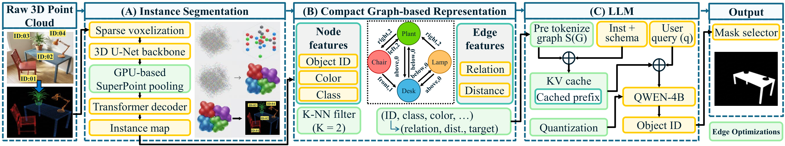

# CORE3D: Edge-Ready 3D Scene-Language Reasoning with Compact Object Graphs

<p align="center">
  
</p>

<p align="center">
  <b>Paper accepted at IJCNN 2026 — Deep Edge Intelligence Workshop</b>
</p>

<p align="center">
  Yatharth Agarwal&emsp;Arghadip Das&emsp;Arnab Raha&emsp;Vijay Raghunathan<br>
  Purdue University &emsp; Intel Corporation
</p>

CORE3D turns raw 3D point clouds into structured scene graphs and runs
large-language-model reasoning over them. It combines
[OneFormer3D](https://github.com/filaPro/oneformer3d) panoptic segmentation
with [EZ-SP](https://github.com/drprojects/superpoint_transformer)
superpoints, graph construction over predicted (or ground-truth) instance
masks, and batched vLLM inference for benchmarks like ScanRefer, Reason3D,
and Surprise3D.

## Installation

Single conda environment (Python 3.10, PyTorch 2.9.0, CUDA 12.8) with vLLM
in the same env. See [docs/INSTALL.md](docs/INSTALL.md).

## Data Preparation

Five raw datasets (ScanNet v2, ScanNet++, ScanRefer, Reason3D, Surprise3D)
plus three provided checkpoints. See [docs/DATA.md](docs/DATA.md).

## Pipeline

Four stages. Run from the repo root with the `core` conda env active.

### 1. Superpoint Generation (EZ-SP)

Generates learned superpoints for ScanNet200 into a sibling directory
(`data/scannet200/super_points_ezsp/`). The segmentator-produced
`data/scannet200/super_points/` is left untouched — the OneFormer3D fork
chooses which dir to read at inference time. ScanNet++ keeps the
segmentator superpoints only.

```bash
bash scripts/run_ezsp.sh data/scannet200 checkpoints/ezsp_scannet200_partition.ckpt
# → data/scannet200/super_points_ezsp/{scene}.bin
```

### 2. OneFormer3D Inference

Panoptic segmentation — run from the
[oneformer3d fork](https://github.com/yathAg/oneformer3d) with the provided
checkpoints. Dump per-scene predictions by setting
`val_evaluator.dump_scene_preds=True` and `val_evaluator.dump_dir=...`.

```bash
# ScanNet200
python tools/test.py configs/oneformer3d_1xb4_scannet200_spconv.py \
    $CORE_PVT/checkpoints/oneformer3d_scannet200.pth \
    --work-dir $CORE_PVT/results/oneformer3d_s200

# ScanNet++
python tools/test.py configs/oneformer3d_1xb4_scannetpp_spconv_sdpa_ext.py \
    $CORE_PVT/checkpoints/oneformer3d_scannetpp.pth \
    --work-dir $CORE_PVT/results/oneformer3d_spp
```

### 3. Graph Generation

Build scene graphs from OneFormer3D predictions.

```bash
# ScanNet200
python -m graph.build_graph --source oneformer --dataset s200 \
    --data-root data/scannet200 \
    --results-dir results/oneformer3d_s200/preds \
    --out-root results/graphs/scannet200_oneformer

# ScanNet++
python -m graph.build_graph --source oneformer --dataset spp \
    --data-root data/scannetpp \
    --results-dir results/oneformer3d_spp/preds \
    --out-root results/graphs/scannetpp_oneformer \
    --label-allowlist data/scannetpp/metadata/semantic_benchmark/top200_semantic.txt
```

### 4. LLM Inference and Evaluation

Batched vLLM inference over the scene graphs, one config per benchmark.
Each run writes per-query predictions and automatically computes IoU
metrics at the end (toggle via `evaluation.compute_metrics` in the
config).

```bash
# ScanRefer (object grounding)
python -m llm.run --config configs/llm/scanrefer.json --split val --graph oneformer

# Reason3D (class-conditional grounding)
python -m llm.run --config configs/llm/reason3d.json --split val --graph oneformer

# Surprise3D (set-based grounding)
python -m llm.run --config configs/llm/surprise3d.json --split val --graph oneformer
```

#### FP8 inference (Hopper / Ada)

To serve the LLM in FP8 (≈2× throughput on H100/L40S, no accuracy loss
for Qwen3-4B-Instruct), pass `--quantization fp8` at the CLI or set
`model.quantization = "fp8"` in the config. vLLM loads the bf16
checkpoint and quantizes weights at startup; no separate FP8 checkpoint
is needed.

```bash
python -m llm.run --config configs/llm/scanrefer.json --split val --graph oneformer \
    --quantization fp8
```

## Citation

If you find CORE3D useful, please cite:

```bibtex
@inproceedings{agarwal2026core3d,
  title     = {Edge-Ready 3D Scene-Language Reasoning with Compact Object Graphs},
  author    = {Agarwal, Yatharth and Das, Arghadip and Raha, Arnab and Raghunathan, Vijay},
  booktitle = {International Joint Conference on Neural Networks (IJCNN),
               Deep Edge Intelligence Workshop},
  year      = {2026}
}
```

## Release checklist

- [x] Code
- [ ] Thor docker setup
- [ ] Checkpoints
- [ ] Preprocessed dataset files (for convenience)

## Acknowledgments

- [OneFormer3D](https://github.com/filaPro/oneformer3d) (Kolodiazhnyi et al., CVPR 2024) — panoptic segmentation backbone
- [Superpoint Transformer](https://github.com/drprojects/superpoint_transformer) (Robert et al., ICCV 2023) — EZ-SP superpoint generation
- [vLLM](https://github.com/vllm-project/vllm) — LLM inference engine

## License

CC-BY-NC-4.0 (see [LICENSE](LICENSE))
